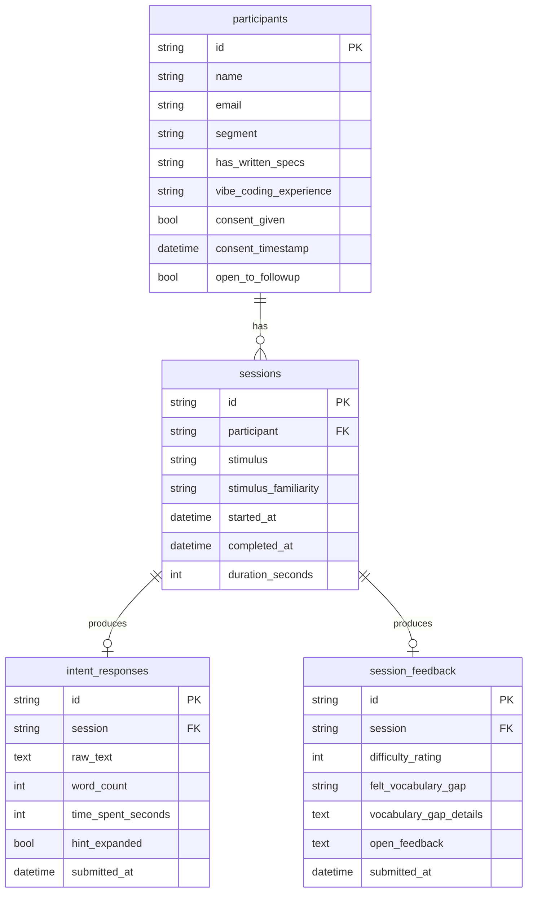

# Database Specification

> PocketBase schema and data model for the Artifact Research App.

## Overview

The database uses **PocketBase** (SQLite embedded) with four collections that track survey participants, sessions, and responses.

## Entity Relationship



## Collections

### participants

Stores user demographics, consent, and contact preferences.

| Field | Type | Required | Options |
|-------|------|----------|---------|
| `name` | text | ✓ | |
| `email` | email | | |
| `segment` | select | ✓ | Technical-adjacent, Non-technical, Engineer, Other, unknown |
| `has_written_specs` | select | | Regularly, Occasionally, Rarely / Never, unknown |
| `vibe_coding_experience` | select | | Extensive, Little, KnowNotUsed, DontKnow, unknown |
| `consent_given` | bool | ✓ | |
| `consent_timestamp` | date | ✓ | |
| `open_to_followup` | bool | | |

---

### sessions

Links participants to survey attempts with timing data.

| Field | Type | Required | Options |
|-------|------|----------|---------|
| `participant` | relation | ✓ | → participants |
| `stimulus` | text | ✓ | |
| `stimulus_familiarity` | select | | Very familiar..., Somewhat familiar, Not very familiar, unknown |
| `started_at` | date | ✓ | |
| `completed_at` | date | | |
| `duration_seconds` | number | | |

---

### intent_responses

Core research artifact — the freeform text describing the user's ideal app.

| Field | Type | Required | Options |
|-------|------|----------|---------|
| `session` | relation | ✓ | → sessions |
| `raw_text` | text | ✓ | max 50,000 chars |
| `word_count` | number | ✓ | |
| `time_spent_seconds` | number | | |
| `hint_expanded` | bool | | |
| `submitted_at` | date | ✓ | |

---

### clarifying_responses

Phase 1 feature — follow-up questions based on missing spec dimensions.

| Field | Type | Required | Options |
|-------|------|----------|---------|
| `session` | relation | ✓ | → sessions |
| `questions_shown` | json | ✓ | Array of question IDs |
| `responses` | json | ✓ | Object {question_id: response_text} |
| `skipped` | bool | ✓ | |
| `submitted_at` | date | ✓ | |

---

### session_feedback

Post-task reflection responses.

| Field | Type | Required | Options |
|-------|------|----------|---------|
| `session` | relation | ✓ | → sessions |
| `difficulty_rating` | number | ✓ | 1-5 |
| `felt_vocabulary_gap` | select | | Yes, No, Unsure, unknown |
| `vocabulary_gap_details` | text | | max 2,000 chars |
| `open_feedback` | text | | max 5,000 chars |
| `submitted_at` | date | ✓ | |

## API Layer

The frontend interacts with PocketBase through an abstraction layer:

| File | Purpose |
|------|---------|
| `src/lib/pocketbase.ts` | Client configuration and TypeScript interfaces |
| `src/lib/api.ts` | CRUD operations and `submitSurvey()` orchestration |

## Schema Import

The schema is defined in `pocketbase/pb_schema.json` and can be imported via:

1. PocketBase Admin UI → Settings → Import collections
2. Paste contents of `pb_schema.json`
3. Click Import

> **Note**: After import, verify each collection's `id` field has autogenerate pattern `[a-z0-9]{15}`.

## Verification

Check database state:

```bash
cd pocketbase
sqlite3 pb_data/data.db "SELECT COUNT(*) FROM participants;"
sqlite3 pb_data/data.db "SELECT COUNT(*) FROM sessions;"
sqlite3 pb_data/data.db "SELECT COUNT(*) FROM intent_responses;"
sqlite3 pb_data/data.db "SELECT COUNT(*) FROM session_feedback;"
```
